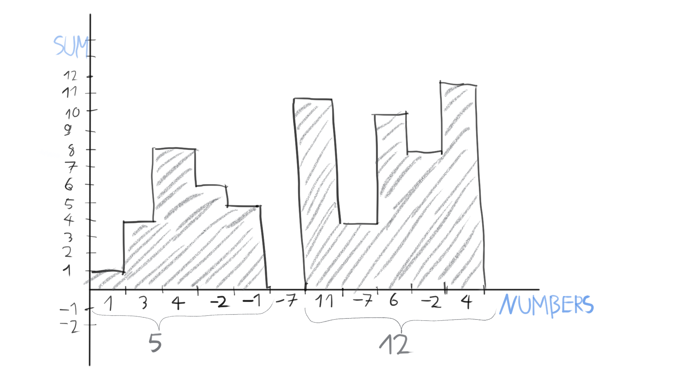

For a given one-dimensional input array of numbers, Kadane's algorithm will
find the maximum **positive** sum, from all possible continuos sub-arrays.

### Description

The array can contain positive, negative values and zero. The trick behind
the algorithms brilliant simplicity comes from the constraint that it will
only maximize sub-arrays that have positive sums. If no such
sub-arrays exist, the returned value will be zero.

The implementation is strikingly simple. Iterate trough the elements and
keep summing them up. If this sum ever dips below zero then set it to zero.
When the rolling sum exceeds the maximum sum seen, then set it as the
maximum. Continue until there are remaining elements.

Since the algorithm isn't concerned with negative sums it can zero the
rolling sum whenever that dips below zero. Conceptually this means, that
the next maximum positive sum cannot contain the current or the previous
elements, because by summing them up, the value would turn negative. Thus
if a sub-array with a total positive sum bigger than what we have already
seen exists, it must start from the next element.

### Illustration



### Complexity

Time: O(n)

Space: O(1)

No hidden constant complexity. Each element has to be truly seen only once.

### Example implementation

```cpp
template<typename T>
T kadane(std::vector<T> const& input)
{
  auto maximal_sum{ 0 };
  auto current_sum{ 0 };

  for (const auto element : input)
  {
    current_sum += element;
    if (current_sum < 0)
    {
      current_sum = 0;
    }
    maximal_sum = std::max(maximal_sum, current_sum);
  }

  return maximal_sum;
}
```
