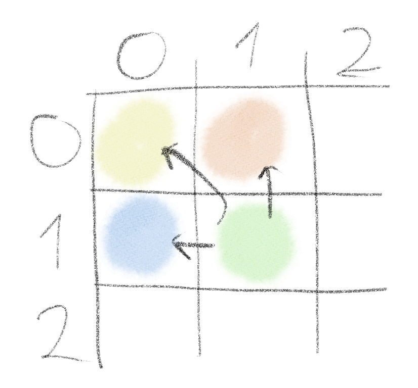

The textbook example (literally) problem is the Longest Common Subsequence. Found
in **Introduction to Algorithms, Third Edition by Thomas H. Cormen, Charles E.
Leiserson, Ronald L. Rivest, Clifford Stein** Chapter 15.4. Perhaps not the most
difficult problem, but one that illustrates the usefulness of dynamic programming
very effectively.

## Problem statement

Given two sequences of characters, X=[x₁, x₂, x₃, ..., xₙ] and Y=[y₁, y₂, y₃, ...,
yₘ], find the longest common subsequence (later LCS) Z=[z₁, z₂, z₃, ..., zₖ] 
where n, m, k >= 1 and n, m, k ∈ ℕ.

**Subsequence**: Given a sequence X=[x₁, x₂, x₃, ..., xₙ], another sequence
Z=[z₁, z₂, z₃, ..., zₖ] is a subsequence of X if there exists a strictly increasing
sequence of indexes [i₁, i₂, i₃, ..., iₗ] such that for all k=1, 2, ..., l
X[iₖ] = Zₖ.

Example:
X = "abcpotcd"
Y = "decpote"
then the longes common subsequence will be: Z = "cpot".

## Recursive solution

We have two sequences as inputs **X** and **Y** and we wish to find the longest
sequence of characters that follow each other and are subsequences for both inputs.
For input sequences **X** and **Y** suppose that we have indexes **i** and **j**,
where **i** indexes **X** and **j** indexes **Y**. Let **X<sub>i</sub>** and
**Y<sub>j</sub>** denote the prefix for each sequence until (including) the
indicated index. The solution we are looking for can be rephrased now as the
longest common sequence for **X<sub>n</sub>** and **Y<sub>m</sub>**.

With this phrasing we can define a recursive solution.

The longest common subsequence for prefixes **X<sub>n</sub>** and **Y<sub>m</sub>**
 (the whole sequences) can only be one of the following:

- if X[n] equals Y[n], then LCS(X<sub>n-1</sub>, Y<sub>m-1</sub>) + **1**
- if X[n] does not equal Y[n], then either LCS(X<sub>n-1</sub>, Y<sub>m</sub>) or
LCS(X<sub>n</sub>, Y<sub>m-1</sub>), which one is bigger, in case they are equal
either one is fine

In other words either **X** matches on the last character with the last character
of **Y** in which case we increase the previously found value by one or choose the
longer LCS between prefix pairs of LCS(X<sub>n-1</sub>, Y<sub>m</sub>) and
LCS(X<sub>n</sub>, Y<sub>m-1</sub>).

```text
LCS(X, i, Y, j):
    if i == 0 or j == 0
        return 0
    if X[i] == Y[j]
        return LCS(X, i-1, Y, j-1) + 1
    else
        return max(LCS(X, i-1, Y, j), LCS(X, i, Y, j-1))
```

Where **max** denotes a function choosing the maximum value between its two
arguments or either one (because they are equal).

### Performance

𝒪(2<sup>n+m</sup>), because for each subsequence of **X** (which is 2<sup>n</sup>)
we have to check each subsequence of **Y** (which is 2<sup>m</sup>), thus
2<sup>n</sup> * 2<sup>m</sup> = 2<sup>n+m</sup>.

Obviously an exponential running time is rather undesirable. Dynamic programming to
the rescue!

## Dynamic programming

First we must check if dynamic programming is applicable. Two requirements must be
satisfied:

- The problem has to have an **optimal substructure**
- The solution must be constructed of **overlapping subproblems**

### Optimal substructure

The algorithm makes a choice between LCS(X, i-1, Y, j-1), LCS(X, i-1, Y, j) and
LCS(X, i, Y, j-1). The first one may not seem like a choice, because it does not
involve a second option like the last two, but it is conditional and as such
acts as a choice.

1. Clearly we have 3 possible subproblems to solve: LCS(X, i-1, Y, j-1),
LCS(X, i-1, Y, j) and LCS(X, i, Y, j-1). All three are mutually independent? Why?
They do not use up resources from one another. Just because LCS(X, i-1, Y, j)
would find a subsequence it does not mean that LCS(X, i, Y, j-1) cannot find
the exact same subsequence. In other words both solutions exist independently,
because the existence of one does not contradict the existence of the other.
2. Assume that one of our three choices is optimal.
3. There are 3 possible choices:
    - X[i] == Y[j], which means the characters match and we count it, and with
    that we have an LCS for sequences X<sub>i</sub> and Y<sub>j</sub>. Let's
    assume that X<sub>i-1</sub> and Y<sub>j-1</sub> do not form an LCS and there
    is a better choice, increasing the total LCS length by at least another one.
    That would mean that LCS for X<sub>i</sub> and Y<sub>j</sub> increases by more
    than one. That is however impossible, because we can only match on one
    character pair at a time, thus the length cannot increase by more than one.
    - X[i] != Y[j], and X<sub>i-1</sub> and Y<sub>j</sub> forms an LCS for
    X<sub>i</sub> and Y<sub>j</sub>. Lets assume that X<sub>i-1</sub> and Y<sub>j</sub> isn't optimal and there exists a longer solution. That would entail that
    the LCS for X<sub>i</sub> and Y<sub>j</sub> increases by at least one. That
    however contradicts the original statement that X[i] != Y[j]. The length
    cannot increase as there are no available character pair to increase it by.
    - X[i] != Y[j], and X<sub>i</sub> and Y<sub>j-1</sub> forms and LCS for
    X<sub>i</sub> and Y<sub>j</sub>. This is symmetric to the previous one.

With this we see that LCS exhibits the optimal substructure property.

### Overlapping subproblems

This problem is indeed constructed of overlapping subproblems. The recursive
solution displays it clearly if we examine the possible branches it can take.
Let's assume we are at LCS(X, i, Y, j). It can call LCS(X, i-1, Y, j-1) or
LCS(X, i-1, Y, j) and LCS(X, i, Y, j-1). The last two would eventually have to
evaluate LCS(X, i-1, Y, j-1) as well, which is a subproblem the algorithm had had
to evaluate on the previous iteration.


With both requirements satisfied for dynamic programming we can finally apply it.

### Top-down

The Top-down solution is in essence exactly the same as the recursive solution. The
only difference is that **memoization** has been added. So previously seen
subproblems will not be evaluated multiple times.

```text
LCS(X, i, Y, j, memo):
    if {<i, j} in memo
        return memo[i, j]
    if i == 0 or j == 0
        memo[i, j] = 0
        return 0
    if X[i] == Y[j]
        value = LCS(X, i-1, Y, j-1, memo) + 1
        memo[i, j] = value
        return value
    else
        value = max(LCS(X, i-1, Y, j, memo), LCS(X, i, Y, j-1, memo))
        memo[i, j] = value
        return value
```

#### Performance

Time-complexity: 𝒪(n*m)

Space-complexity: 𝒪(n*m)

### Bottom-up

The Bottom-up solution is a little bit different and it necessitates the
observation that for each {i, j} pair we have to solve the LCS problem for
{i-1, j-1}, {i-1, j} and {i, j-1}. If we were to create a **dp** matrix where the
of height is length(X) and width of length(Y) we could store the result to each
subproblem in it. More importantly this matrix can be filled up from the top row,
from the left to right, in the common fashion as each matrix entry of {i, j} only
depends on the entries to its left, above it and from the entry above and left
from it.



```text
LCS(X, Y):
    dp = zero matrix of height length(X) + 1, and width of length(Y) + 1

    if X is empty or Y is empty:
        return 0

    for i = 0 to length(X)
        for j = 0 to length(Y)
            if X[i] == Y[j]
                dp[i + 1][j + 1] = dp[i][j] + 1
            else
                dp[i + 1][j + 1] = max( dp[i + 1][j], dp[i][j + 1]

    return dp[length(X)][length(Y)]
```

Do not be intimidated by the indexing. It is just a trick so the check for invalid
values is avoided. dp[i + 1][j + 1] = dp[i][j] + 1 is the same as writing
dp[i][j] = dp[i - 1][j - 1] + 1, but in the latter we would have to write checks
not to get out of the bound of the matrix.

#### Performance

Time-complexity: 𝒪(n*m)

Space-complexity: 𝒪(n*m)

## Execution speed using C++ implementations

Code can be found [here](https://github.com/TheMrAI/Cpp/blob/master/algorithms/include/dynamic_programming.h).

|Input length|Recursive|Top-down|Bottom-up|
|----|----|----|----|
|10|673'747 ns|644 ns|286 ns|
|100|N/A|61'568 ns|17'266 ns|
|1000|N/A|7'269'949 ns|3'930'985 ns|

Even though we have seen the time and space complexity for both the Top-down and
Bottom-up solutions are the same, in practice the Buttom-up solution runs at least
twice as fast. This is because it performs no checks to see if a subproblem was
already evaluated. It just blindly calculates everything that it needs and
that is it.
