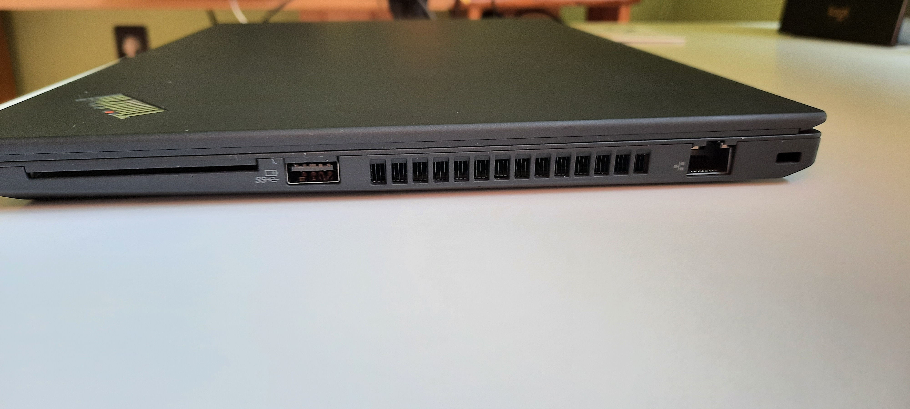
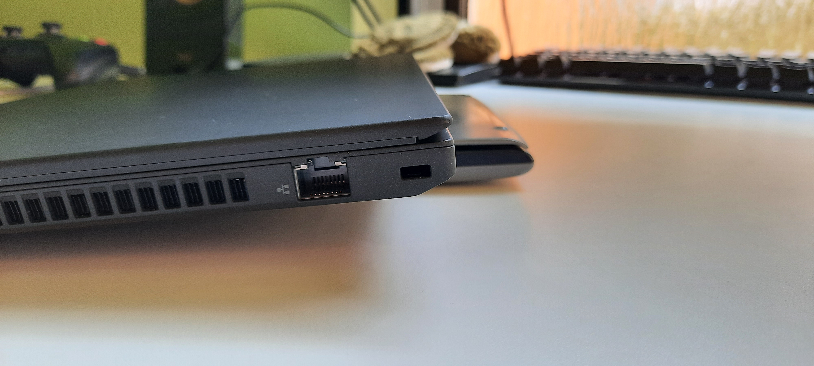
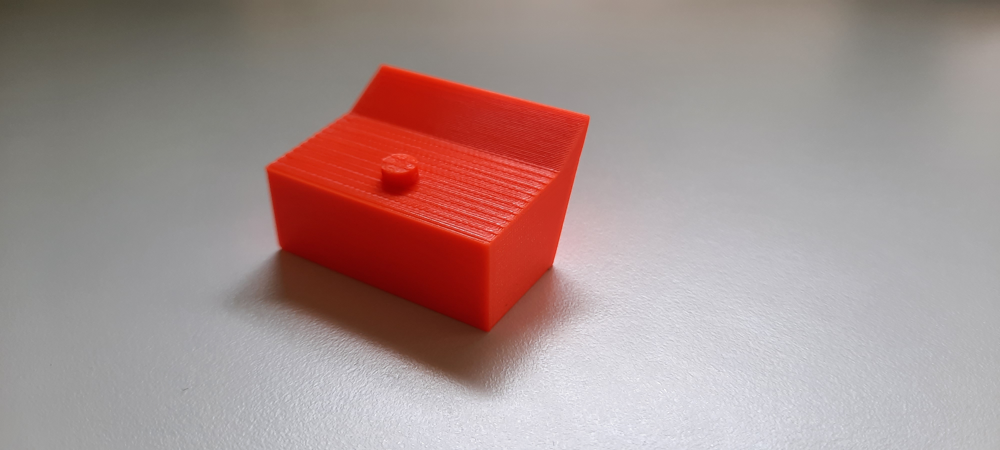
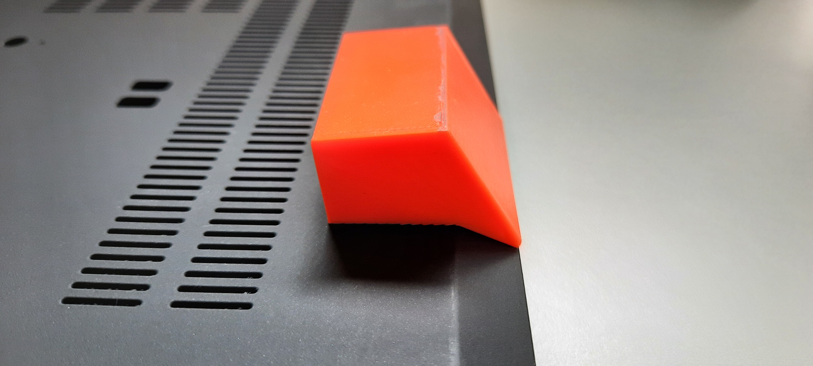
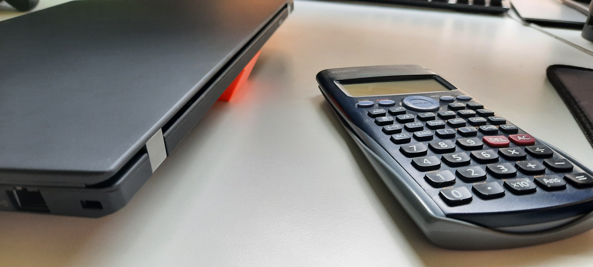

Fusion 360 link: [laptop_stand](https://drive.google.com/file/d/1PPjS1Oo1_NPz1fMau9EfA9M-WzJKoiLt/view?usp=sharing)

Not all projects need to be complicated. In fact this one was one of the simplest of all, but it
solves a real problem, and for that I appreciate it very much.

My laptop, a [Lenovo T14 Gen 2](https://www.lenovo.com/hu/hu/laptops/thinkpad/t-series/T14-G2-Intel/p/22TPT14T4N2),
as many modern equipment today advertised towards the bushiness costumer
( despite it's ~2500 EUR price-tag at the time of writing ) tends to heat up quite a bit after a little while.

As all laptops the biggest constraint towards their continued performance is heat. They start heating up and when they do
there is only one thing that the internal machinery can do to keep the system going. It starts to throttle
the CPU until temperatures stabilize somewhere around 90 degrees Celsius. That is a bit toasty and a bit sad.
Throttling means the juicy power that was paid for cannot come out and we would like to have every bit of it.

One of the problems is that the distance between the bottom of the laptop and the table is very small. According to my caliper
measurements about 1.89 mm. That is a little too tight for the fans to be able to efficiently suck in air, as the radial
fans used simply cannot create high static pressure, nor are they designed to do that. Their goal is to provide the highest airflow
possible.

What can we do? Well, put something under it, of course, and raise it up!

The calculator provides an optimal gap of about 20 mms. With the added benefit of providing a slight but comfortable angle
of about 20 degrees of depression. Very nice! Good enough that I forgot about the issue for about 6 months at which point
my calculator was missing enough times that I decided to fix the issue properly.

After meticulous measurement, eyeballing, guessing, trying then retrying the perfect shape was born!

Now the laptop, doesn't throttle ( that much ) and I got my calculator back!
