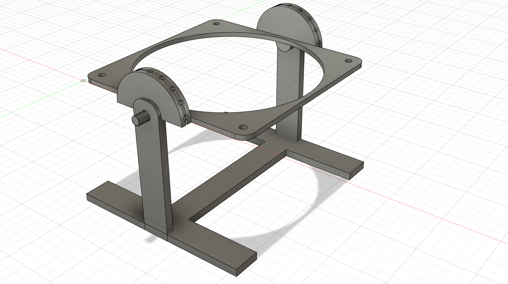
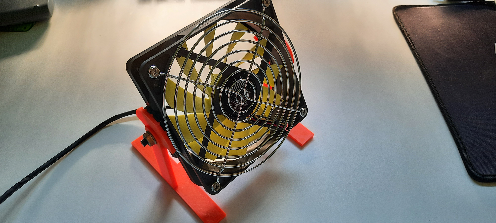
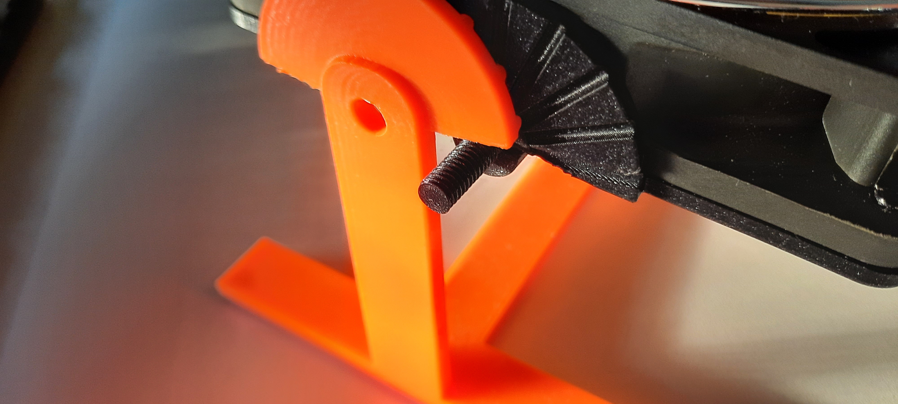
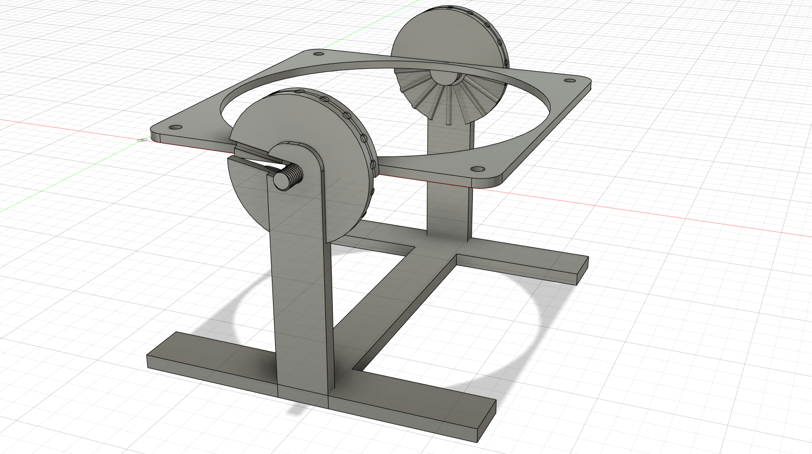
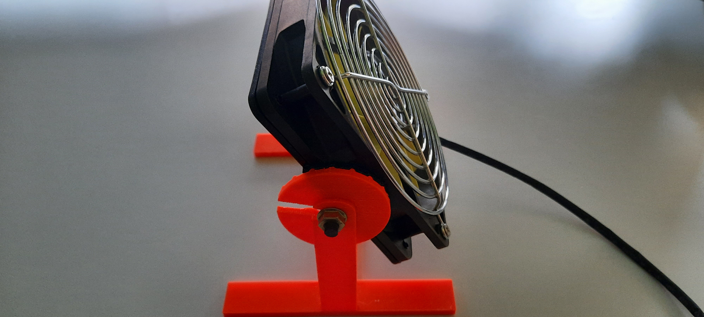

Fusion 360 link: [table_fan](https://drive.google.com/file/d/1xaoRFsdWr-SbcTNqeKaUtKMEPf8zrqWq/view?usp=sharing)

Summers are hot where I live, and even though I have a big fan that moves more
than enough air to provide help my body enough with its evaporative cooling,
it has one problem. It is more than enough. It moves too much air, and it is
loud compared to what I need.

In the empire of dirt there is an abundance of 12 cm diameter radial cooling
fans. These are usually optimized to move as much air and as quietly as
possible. Exactly what I am looking for. And from about half a meter distance
the cooling it provides seems to be sufficient, which means if I could make a stand
for it, which allows angular adjustments and put it on my table it should satisfy
all my requirements.

## First version

There is one major issue with this design. Should one try to assemble the "fan
holder" section which then should be put into the stand, it becomes evident that
this isn't possible. There is simply not enough space to insert the "fan holder".

Managed to assemble it, but that required an uncomfortable amount of bending, so
it would be best if we could avoid it in the future.

## Second version

Extended the half circles on the stand to be full circles making the printing
without support materials possible. But more importantly solved the assembly issue
by adding two cutouts into each side at a shallow angle. These groves allow the fan
base to be simply slide onto its stand.
